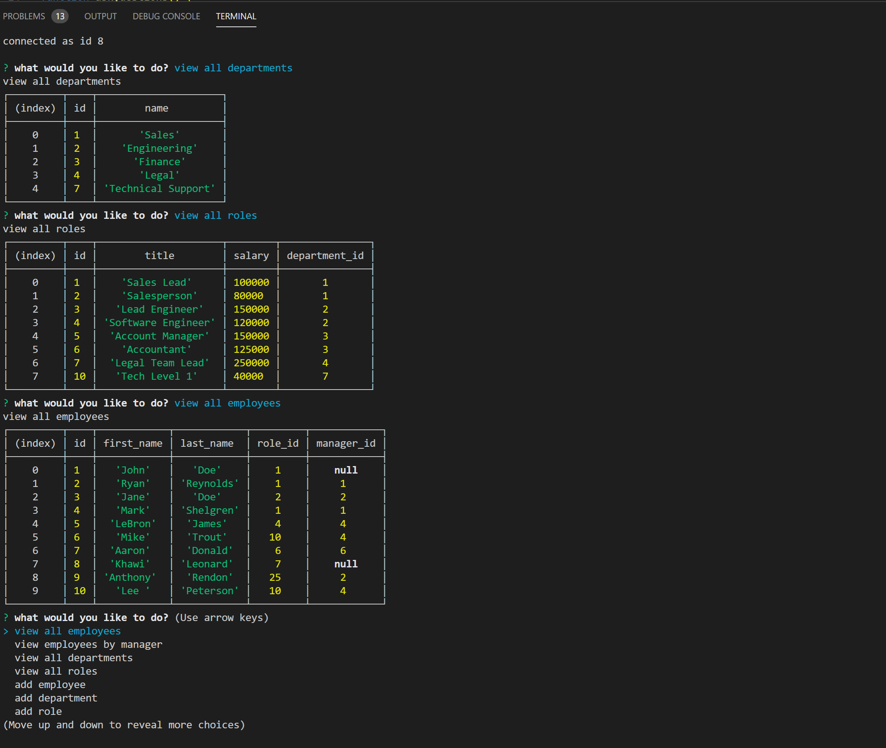

Homework Assignment 12 MySQL - Employee Tracker

# Employee Tracker

Create and save unlimited departments, roles and employees to help you manage your most valuable resources!

The purpose of this project was to build an application that can add, display, update and save, and departments, roles and employees using an express backend and a MyQL database to store all employee related data. The project user story is below.

```
As a business owner
I want to be able to view and manage the departments, roles, and employees in my company
So that I can organize and plan my business
```

## Minimum Requirements

- Functional application.

- GitHub repository with a unique name and a README describing the project.

- The command-line application should allow users to:

  - Add departments, roles, employees

  - View departments, roles, employees

  - Update employee roles

## Bonus

- The command-line application should allow users to:

  - Update employee managers

  - View employees by manager

  - Delete departments, roles, and employees

  - View the total utilized budget of a department -- ie the combined salaries of all employees in that department

## Getting Started

Below is a print screen from the application, the link to the project repository and a link to the deployed application on Heroku.



### Development

Below are the steps I took to create the application as it is so far. The most difficult aspect of this application for me was using a constructor to cover all aspects of the notes (writing, reading, saving, deleting).

1. Created and seeded the initial MySQL files.

2. Downloaded all dependencies using npm.

3. Created the application using Node.js and tested.

4. Verify the functionality of the application.

Github Repository: https://github.com/markshelgren/employeeTracker

Video of the application: https://youtu.be/tcIAf4F40II

## Testing

This application was not developed using Test Driven Development. However, at numerous points throughout development, console.log's were used to test the results of new elements.

## Deployment

This program can be viewed and deployed using most internet browsers via the links in the "Getting Started" section.

## Built With

- [VSCode](https://code.visualstudio.com/) - The platform I used for developing this project.
- [GoogleChrome](https://www.google.com/chrome/) - Used for inspector tool and validating the program during development.
- [NodePackageManager](https://www.npmjs.com/) - Used to install node modules/dependencies
- [Postman](https://www.getpostman.com/) - A collaboration platform for API development.

## Authors

- **Mark Shelgren** - [markshelgren](https://github.com/markshelgren)

## Acknowledgments

- The advisors, instructors, and TAs at the Coding Bootcamp at the University of California, Irvine
- Fellow classmates at the Coding Bootcamp at UC Irvine
- Friends in the industry
